# 线性表篇（顺序表、链表）

线性表（Linear List）。顾名思义，线性表就是数据排成像一条线一样的结构。
每个线性表上的数据最多只有前和后两个方向。其实除了数组，链表、队列、栈等也是线性表结构。


## 快速导航

- [认识线性表](#认识线性表)
- [数组](#数组)
- [链表](#链表)
    - [单向链表](#单向链表)
    - [双向链表](#双向链表)
    - [循环链表](#循环链表)
- [如何轻松写出正确的链表代码？](#如何轻松写出正确的链表代码？)
- [必知必会算法题](#必知必会算法题)

## 认识线性表

根据线性表的定义，可得出几个关键词：**n 个数据元素**、**有限序列**，也就是说它是有长度限制的且元素之间是有序的，在多个元素之间，第一个元素无前驱，最后一个元素无后继，中间元素有且只有一个前驱和后继。

举一个与大家都息息相关的十二生肖例子，以“子（鼠）” 开头，“亥（猪）”结尾，其中间的每个生肖也都有其前驱和后继，图例如下所示：

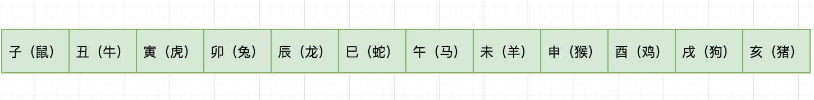

下面再介绍一个**复杂的线性表，其一个元素由多个数据项构成**，例如，我们的班级名单，含学生的学号、姓名、年龄、性别等信息，图例如下所示：

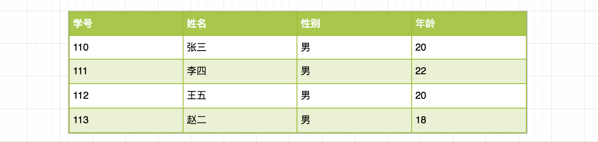

**线性表两种存储结构**

线性表有两种存储结构，一种为顺序结构存储，称为**顺序表**；另一种为链式形式存储，称为**链表**，链表根据指针域的不同，链表分为单向链表、双向链表、循环链表等。详细的内容会在后面展开讲解。

## 数组

顺序表是在计算机内存中以数组的形式保存的线性表，是指用一组地址连续的存储单元依次存储数据元素的线性结构。

- 数组（Array）是一种线性表数据结构。它用一组连续的内存空间，来存储一组具有相同类型的数据。
- 是连续的内存空间和相同类型的数据,它才有了一个堪称“杀手锏”的特性：“随机访问”。但有利就有弊，这两个限制也让数组的很多操作变得非常低效，比如要想在数组中删除、插入一个数据，为了保证连续性，就需要做大量的数据搬移工作。
- 对于数组来说，存储空间是连续的，所以在加载某个下标的时候可以把以后的几个下标元素也加载到CPU缓存这样执行速度会快于存储空间不连续的链表存储。

**一维数组的内存寻址公式**
```java
int[] a = new int[3];
a[3] = 10;
```

**警惕数组的访问越界问题**
```java
int[] a = new int[3];
a[3] = 10;
```
**容器能否完全替代数组？**
- Java ArrayList 无法存储基本类型，比如 int、long，需要封装为 Integer、Long 类，而 Autoboxing、Unboxing 则有一定的性能消耗，所以如果特别关注性能，或者希望使用基本类型，就可以选用数组。
- 如果数据大小事先已知，并且对数据的操作非常简单，用不到 ArrayList 提供的大部分方法，也可以直接使用数组。
**实现一个扩容缩容数组**
```php
<?php
class myClass
{
    private $data;
    private $length;
    private $capacity;

    public function __construct($capacity)
    {
        $capacity = intval($capacity);
        if ($capacity <= 0) return null;

        $this->data     = array();
        $this->capacity = $capacity;
        $this->length   = count($this->data);

    }

    private function checkIfFull($index)
    {
        if ($index>=$this->capacity) {
            return true;
        }
        return false;
    }

    private function checkOutOfRange($index)
    {
        if ($index <= $this->capacity) {
            return true;
        }
        return false;
    }

    public function insert($index, $value)
    {
        $index = intval($index);
        $value = intval($value);
        if ($index < 0) {
            return 1;
        }

        if ($this->checkIfFull($index)) {
            $this->resize(intval(1.5 * $index));
        }


        for ($i = $this->length - 1; $i > $index; $i--) {
            $this->data[$i + 1] = $this->data[$i];
        }

        $this->data[$index] = $value;
        $this->length++;
        return 0;
    }

    public function delete($index)
    {
        $value = 0;
        $index = intval($index);
        if ($index < 0) {
            $code = 1;
            return [$code, $value];
        }

        if ($this->checkOutOfRange($index)) {
            $code = 2;
            return [$code, $value];
        }

        $value = $this->data[$index];
        for ($i = $index; $i < $this->length - 1; $i++) {
            $this->data[$i] = $this->data[$i + 1];
        }
        $this->length--;
        return [0, $value];

    }

    public function find($index)
    {

        $value = 0;
        $index = intval($index);
        if ($index < 0) {
            $code = 1;
            return [$code, $value];
        }
        if ($this->checkOutOfRange($index)) {
            $code = 2;
            return [$code, $value];
        }
        return [0, $this->data[$index]];
    }

    private function resize($capacity)
    {
        $newData = new myClass($capacity);
        for ($i = 0; $i < $this->length; $i++) {
            $newData->data[$i] = $this->data[$i];
        }
        $this->data = $newData->data;
        $this->capacity=$capacity;
    }
}
?>

```

**插入元素**

在数组中第 i 个位置之前插入新的数据元素 e，在插入之前先进行元素位置后移，插入之后顺序表元素的长度要加 1。

举个例子，我们去火车站取票，恰逢人多大家都在排队，突然来一个美女或者帅哥对你说我的车次马上要开车了，你可能同意了，此时你的位置及你后面的童鞋就要后移一位了，也许你会听到一些声音，怎么回事呀？怎么插队了呀，其实后面的人有的也不清楚什么原因 “233”，看一个图
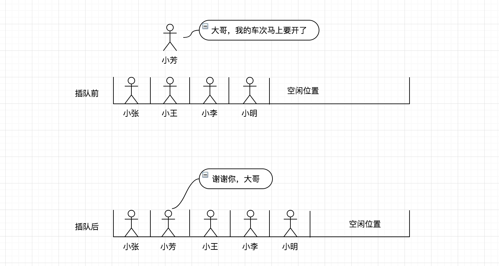


**删除元素**

删除数组表的第 i 个数据元素，并返回其值，与插入相反，需要将删除位置之后的元素进行前移，最后将顺序表元素长度减 1。

但是在某些特殊场景下，我们并不一定非得追求数组中数据的连续性，将多次删除操作集中在一起执行。这也是JVM 标记清除垃圾回收算法的核心思想。


同样以火车站取票的例子说明，如果大家都正在排队取票，突然你前面一个妹子有急事临时走了，那么你及你后面的童鞋就要前进一步，图例如下所示：
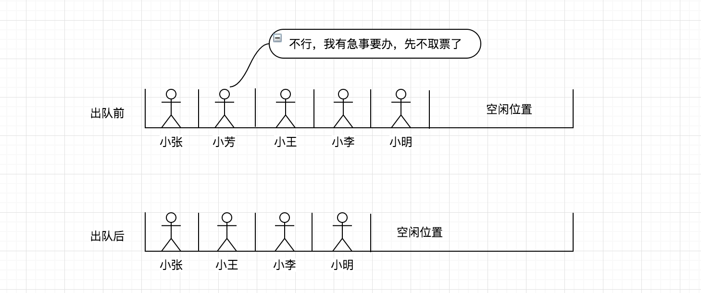


**数组优缺点总结**

插入、删除元素如果是在最后一个位置时间复杂度为 O(1)，如果是在第一个（或其它非最后一个）位置，此时时间复杂度为 O(1)，就要移动所有的元素向后或向前，时间复杂度为 O(n)，当数组的长度越大，插入和删除操作可能就需要大量的移动操作。

对于存取操作，可以快速存取数组中任意位置元素，时间复杂度为 O(1)。

## 链表

链表（Linked list）是一种常见的基础数据结构，是一种线性表，但是并不会按线性的顺序存储数据，而是在每一个节点里存到下一个节点的指针(Pointer)。由于不必须按顺序存储，**链表在插入的时候可以达到O(1)的复杂度**，比另一种线性表数组快得多。
但是**链表查找一个节点或者访问特定编号的节点的时间复杂度O(n)，而数组的时间复杂度分别是O(logn)和O(1)**。

使用链表结构可以克服数组链表需要预先知道数据大小的缺点，链表结构可以充分利用计算机内存空间，实现灵活的内存动态管理。但是链表失去了数组随机读取的优点，同时链表由于增加了节点的指针域，空间开销比较大。

### 单向链表

链表中最简单的一种是单向链表，它包含两个域，一个信息域和一个指针域。这个链接指向列表中的下一个节点，而最后一个节点则指向一个空值，图例如下：


除了单向链表之外还有双向链表、循环链表，在学习这些之前先从单向链表开始，因此，这里会完整讲解单向链表的实现，其它的几种后续都会在这个基础之上进行改造。

>我们习惯性地把第一个结点叫作头结点，把最后一个结点叫作尾结点。其中，头结点用来记录链表的基地址。
>有了它，我们就可以遍历得到整条链表。而尾结点特殊的地方是：指针不是指向下一个结点，而是指向一个空地址 NULL，表示这是链表上最后一个结点。


**插入删除O(1)**

链表中插入或者删除一个数据，我们并不需要为了保持内存的连续性而搬移结点，因为链表的存储空间本身就不是连续的。
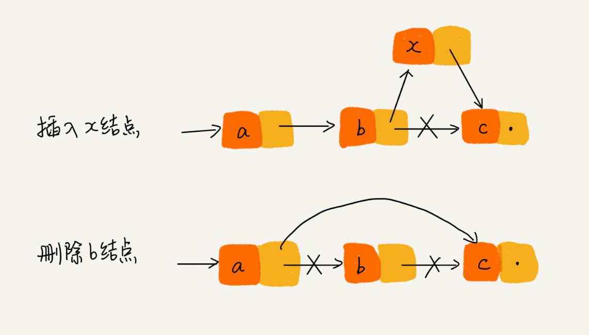

**随机访问O(n)**

链表中的数据并非连续存储的，所以无法像数组那样，根据首地址和下标，通过寻址公式就能直接计算出对应的内存地址，而是需要根据指针一个结点一个结点地依次遍历，直到找到相应的结点。


**单向链表与数组优缺点比较**

* **查找**：单向链表时间复杂度为 O(n)；数组时间复杂度为 O(1)
* **插入与删除**：单向链表时间复杂度为 O(1)；数组需要移动元素时间复杂度为 O(n)
* **空间性能**：单向链表无需预先分配存储空间；数组需要预先分配内存空间，大了浪费，小了易溢出

### 双向链表

双向链表也叫双链表。与单向链表的区别是双向链表中不仅有指向后一个节点的指针，还有指向前一个节点的指针。这样可以从任何一个节点访问前一个节点，当然也可以访问后一个节点，以至整个链表。

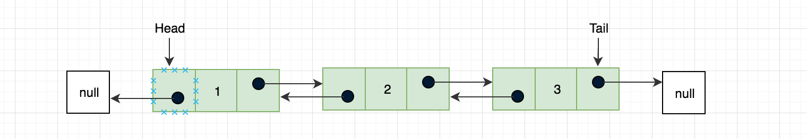

双向链表是基于单向链表的扩展，很多操作与单向链表还是相同的，在构造函数中我们要增加 prev 指向前一个元素的指针和 tail 用来保存最后一个元素的引用，可以从尾到头反向查找，重点修改插入、删除方法。


**修改链表指定位置插入元素**

在双向链表中我们需要控制 prev 和 next 两个指针，比单向链表要复杂些，这里可能会出现三种情况：

***情况一：链表头部添加***

如果是在链表的第一个位置插入元素，当 head 头部指针为 null 时，将 head 和 tail 都指向 node 节点即可，如果 head 头部节点不为空，将 node.next 的下一个元素为 current，那么同样 current 的上个元素就为 node（current.prev = node），node 就为第一个元素且 prev（node.prev = null）为空，最后我们将 head 指向 node。

假设我们当前链表仅有一个元素 b，我们要在第一个位置插入元素 a，图例如下：

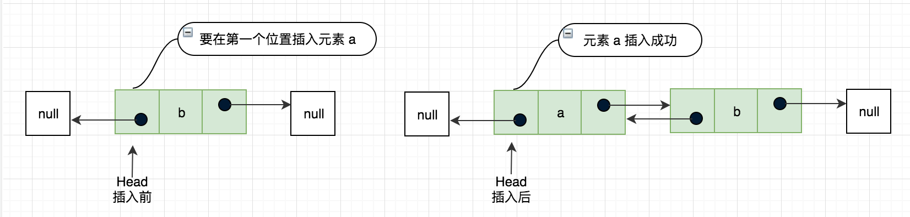

***情况二：链表尾部添加***

这又是一种特殊的情况链表尾部添加，这时候我们要改变 current 的指向为 tail（引用最后一个元素），开始链接把 current 的 next 指向我们要添加的节点 node，同样 node 的上个节点 prev 就为 current，最后我们将 tail 指向 node。

继续上面的例子，我们在链表尾部在增加一个元素 d

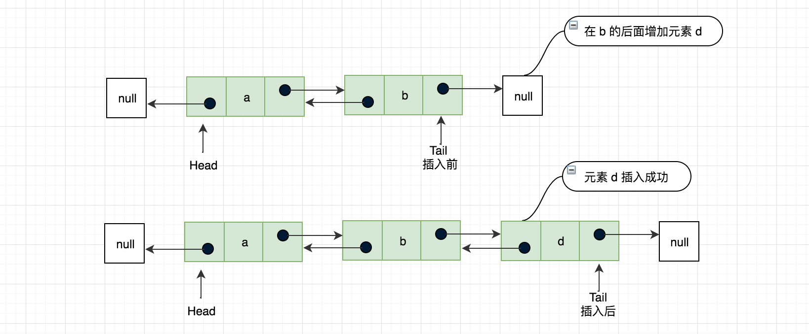

***情况三：非链表头部、尾部的任意位置添加***

这个和单向链表插入那块是一样的思路，不清楚的，在回头去看下，只不过增加了节点的向前一个元素的引用，current.prev 指向 node，node.prev 指向 previous。

继续上面的例子，在元素 d 的位置插入元素 c，那么 d 就会变成 c 的下一个元素，图例如下：

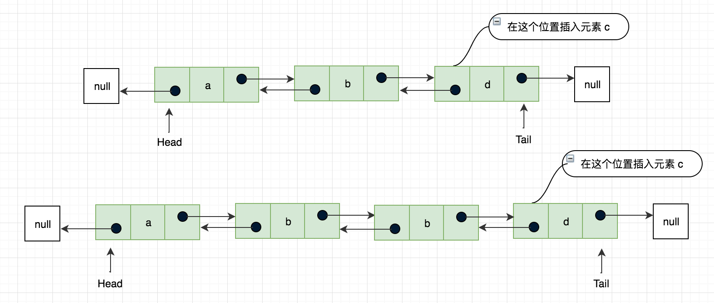
：


**移除链表元素**

双向链表中移除元素同插入一样，需要考虑三种情况，下面分别看下各自实现：

***情况一：链表头部移除***

current 是链表中第一个元素的引用，对于移除第一个元素，我们让 head = current 的下一个元素，即 current.next，这在单向链表中就已经完成了，但是双向链表我们还要修改节点的上一个指针域，再次判断当前链表长度是否等于 1，如果仅有一个元素，删除之后链表就为空了，那么 tail 也要置为 null，如果不是一个元素，将 head 的 prev 设置为 null，图例如下所示：

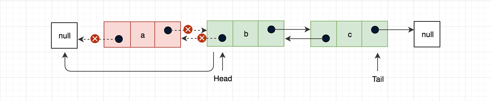

***情况二：链表尾部移除***

改变 current 的指向为 tail（引用最后一个元素），在这是 tail 的引用为 current 的上个元素，即最后一个元素的前一个元素，最后再将 tail 的下一个元素 next 设置为 null，图例如下所示：

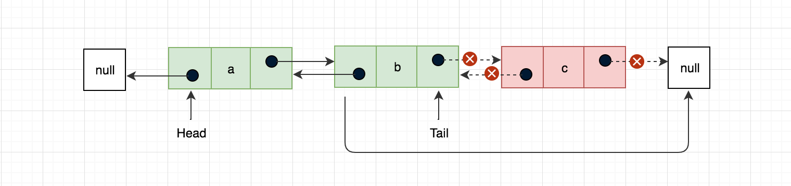

***情况三：链表尾部移除***

这个和单向链表删除那块是一样的思路，不清楚的，在回头去看下，只增加了 current.next.prev = previous 当前节点的下一个节点的 prev 指针域等于当前节点的上一个节点 previous，图例如下所示：

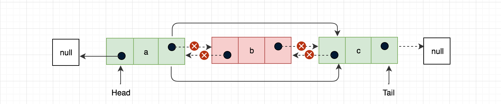：


### 循环链表

在单向链表和双向链表中，如果一个节点没有前驱或后继该节点的指针域就指向为 null，循环链表中最后一个节点 tail.next 不会指向 null 而是指向第一个节点 head，同样双向引用中 head.prev 也会指向 tail 元素，如下图所示：

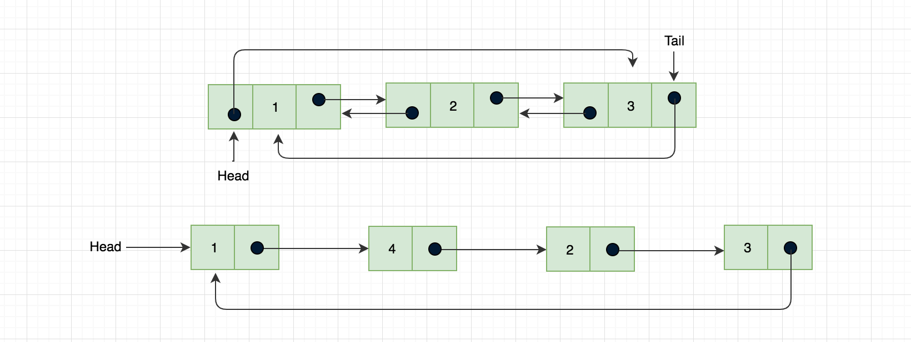

**可以看出循环链表可以将整个链表形成一个环，既可以向单向链表那样只有单向引用，也可以向双向链表那样拥有双向引用。**

**链表任意位置插入元素**

实现同链表尾部插入相似，注意：将新节点插入在原链表头部之前，首先，要将新节点的指针指向原链表头节点，并遍历整个链表找到链表尾部，将链表尾部指针指向新增节点，图例如下：

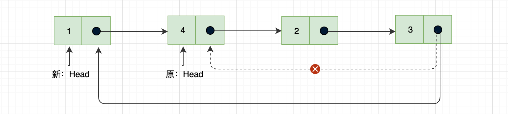


最后在遍历的时候也要注意，不能在根据 current.next 是否为空来判断链表是否结束，可以根据链表元素长度或者 current.next 是否等于头节点来判断，本节源码实现链接如下所示：

## 如何轻松写出正确的链表代码？

**技巧一：理解指针或引用的含义**

将某个变量赋值给指针，实际上就是将这个变量的地址赋值给指针，或者反过来说，指针中存储了这个变量的内存地址，指向了这个变量，通过指针就能找到这个变量。

**技巧二：警惕指针丢失和内存泄漏**

插入删除结点时，一定要注意操作的顺序

**技巧三：利用哨兵简化实现难度**

针对链表的插入、删除操作，需要对插入第一个结点和删除最后一个结点的情况进行特殊处理

如果我们引入哨兵结点，在任何时候，不管链表是不是空，head 指针都会一直指向这个哨兵结点。我们也把这种有哨兵结点的链表叫带头链表。相反，没有哨兵结点的链表就叫作不带头链表。

**技巧四：重点留意边界条件处理**

- 如果链表为空时，代码是否能正常工作？
- 如果链表只包含一个结点时，代码是否能正常工作？
- 如果链表只包含两个结点时，代码是否能正常工作？
- 代码逻辑在处理头结点和尾结点的时候，是否能正常工作？

**技巧五：举例画图，辅助思考**

## 必知必会算法题

- 实现两个有序数组合并为一个有序数组

```go
func merge(nums1 []int, m int, nums2 []int, n int)  {
	sorted := make([]int, 0, m+n)
	p1,p2:=0,0
	for {
		if p1==m{
			sorted=append(sorted,nums2[p2:]...)
			break
		}
		if p2==n{
			sorted=append(sorted,nums1[p1:]...)
			break
		}
		if nums1[p1]<=nums2[p2]{
			sorted=append(sorted,nums1[p1])
			p1++
		}else{
			sorted=append(sorted,nums2[p2])
			p2++
		}
	}

	 copy(nums1,sorted)
}

```

- 单链表反转

```go
func reverseList(head *ListNode) *ListNode {
	cur := head
	var pre *ListNode
	for cur!=nil {
		next:=cur.Next
		cur.Next=pre
		pre=cur
		cur=next
	}
	return pre
}
```

- 中环的检测

```go
func hasCycle(head *ListNode) bool {
	if head==nil{
		return false
	}
	first,slow:=head,head
	for first!=nil&&first.Next!=nil {
		first=first.Next.Next
		slow=slow.Next
		if first==slow{
			return true
		}
	}
	return false
}
```

- 两个有序的链表合并

```go
func mergeTwoLists(l1 *ListNode, l2 *ListNode) *ListNode {
	head:=&ListNode{0,nil}
	p:=head
	for l1!=nil&& l2!=nil{
		if l1.Val<=l2.Val{
			p.Next=l1
			l1=l1.Next
		}else{
			p.Next=l2
			l2=l2.Next
		}
        p=p.Next
	}
	if l1==nil{
		p.Next=l2
	}
	if l2==nil{
		p.Next=l1
	}
	return head.Next
}
```

- 删除链表倒数第 n 个结点

```go
func removeNthFromEnd(head *ListNode, n int) *ListNode {
	dummy := &ListNode{0, head}
	first, second := head, dummy
	for i := 0; i < n; i++ {
		first = first.Next
	}
	for ; first != nil; first = first.Next {
		second = second.Next
	}
	second.Next = second.Next.Next
	return dummy.Next
}
```

- 回文链表

```go
func isPalindrome(head *ListNode) bool {
	fast,slow:=head,head
	for fast.Next!=nil&&fast.Next.Next!=nil {
		fast=fast.Next.Next
		slow=slow.Next
	}
	head2:=reverseList(slow)
	for head2!=nil&&head!=nil{
		if head.Val!=head2.Val{
			return false
		}
		head2=head2.Next
		head=head.Next
	}
	return true
}
```
- 环形链表入口
```go
func detectCycle(head *ListNode) *ListNode {
    	if head == nil {
		return nil
	}
	fast, slow := head, head
	for fast != nil {
		slow = slow.Next
		if fast.Next != nil {
			fast = fast.Next.Next
		} else {
			return nil
		}

		if fast == slow {
			pre := head
			for pre != slow {
				pre = pre.Next
				slow = slow.Next
			}
			return pre
		}
	}
	return nil  
}
```


## 总结

本节主要讲解的是线性表，从数组->单向链表->双向链表->循环链表，这个过程也是循序渐进的，前两个讲的很详细，双向链表与循环链表通过与前两个不同的地方进行比较针对性的进行了讲解，另外学习线性表也是学习其它数据结构的基础，数据结构特别是涉及到一些实现算法的时候，有时候并不是看一遍就能理解的，总之**多实践**、**多思考**。

## Reference

* [https://zh.wikipedia.org/wiki/线性表](https://zh.wikipedia.org/wiki/线性表)
* [大话数据结构](https://book.douban.com/subject/6424904/)