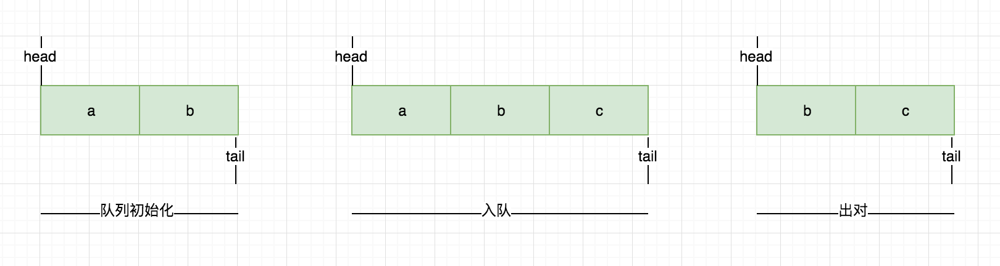
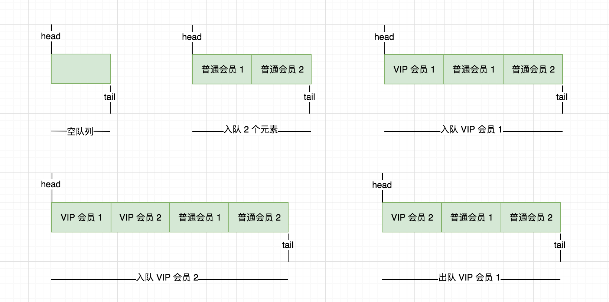
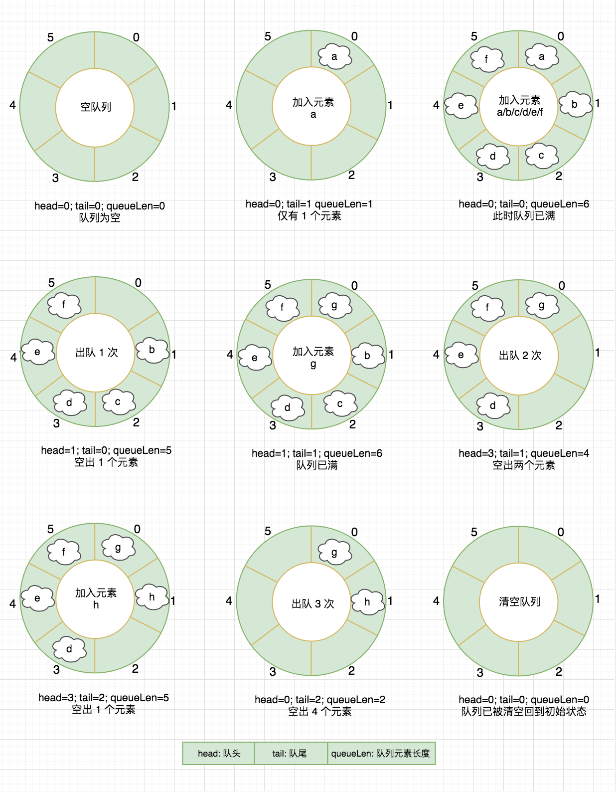

# 数据结构知否知否系列之 — 队列篇

队列，英文 First In First Out 简称 FIFO，遵从先进先出的原则，与 “栈” 相反，在队列的尾部添加元素，在队列的头部删除元素，如果队列中没有元素就称为空队列。

队列对应到生活场景中有很多例子，例如，我们去火车站窗口购票总要排队，先排队的人先购票，有新的人来了则在队尾排队等待前面的完成了依次购票。另外我们的订单超时队列、活动抢购先到先得等等，队列在生活中应用很广泛。

##  数组实现队列

 中提供的数组功能即可实现一个简单的队列，使用起来也很方便，熟悉相关 API 即可，下面我们来看下基于 JS 数组的入队、出队过程实现。



以上图片展示了队列的初始化、入队、出队过程，下面我们采用 JavaScript 原型链的方式实现。

**初始化队列**

初始化一个存储队列中元素的数据结构，如果未传入默认赋值空数组，传入需先校验类型是否正确。

```js
function QueueStudy(elements) {
    if (elements && !(elements instanceof Array)) {
        throw new Error('必须为数组格式！');
    }

    this.elements = elements || [];
}
```

**队列添加元素**

实现一个 enQueue 方法，向队列添加元素，注意只能是队列尾部添加，使用 JavaScript 数组中的 push 方法。

```js
QueueStudy.prototype.enQueue = function(element) {
    this.elements.push(element);
}
```

**队列移除元素**

实现一个 deQueue 方法，向队列头部弹出元素，使用 JavaScript 数组中的 shift 方法。

```js
QueueStudy.prototype.deQueue = function() {
    return this.elements.shift();
}
```


## 优先队列

优先队列，元素的添加、删除是基于优先级进行的。一个现实的例子就是机场登机的顺序。头等舱和商务舱乘客的优先级要高于经济舱乘客。在有些国家，老年人和孕妇（或带小孩的妇女）登机时也享有高于其他乘客的优先级。

优先队列对应到我们生活场景中也有很多例子，例如我们去银行办理业务，一般都会排号先到的先办理，但是呢，还会有 VIP 会员优先办理，又或者去火车站窗口上购票也会有提示军人可以优先办理等等

**实现步骤**

核心实现继 JavaScript 数组实现队列的例子，对入队函数进行改造如下所示：

* 声明 queueElement 对象，包含了要添加到队列的元素
* 如果队列为空直接入队
* 如果找到一个比 priority 优先级大的元素，插入新元素，这里使用到了 JS 数组中的 splice 方法
* 最后如果队列中的所有元素的优先级都小于 priority，则直接在队列尾部入队
* 另外打印输出的方法也做了简单修改


**图例展示**

下面以图例的形式展示以上优先队列程序的运行过程



以上是将优先级最小的元素放置于队列前面，称之为最小优先队列，最大优先队列的实现则反之。源码参见 [https://github.com/Q-Angelo/project-training/tree/master/algorithm/queue-priority.js](https://github.com/Q-Angelo/project-training/tree/master/algorithm/queue-priority.js)

## 循环队列

循环队列有些地方也称之为**环形队列**，其本身是一种环形结构的队列，相较于普通队列有个好处是第一个元素出队之后，剩下元素无需依次向前移位，充分利用了向量空间，在以下介绍中给出了完整的实现过程。

在设计环形队列时即可顺时针也可逆时针两个方向进行实现，在入队时可根据 (tail % capacity) 规则，进行队尾添加元素，tail 表示队尾的指针，capacity 表示容量，出队同样以（head % capacity）规则操作，head 表示队头指针，下面以长度为 6 的队列进行图文形式说明下实现过程。




g/queue-ring.png


