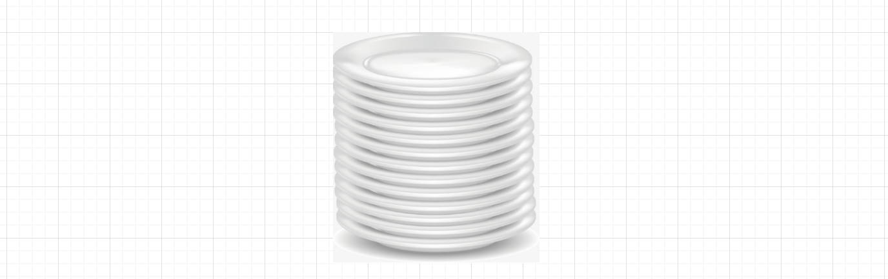
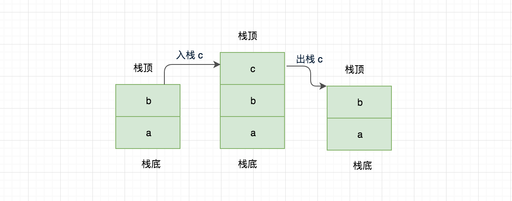
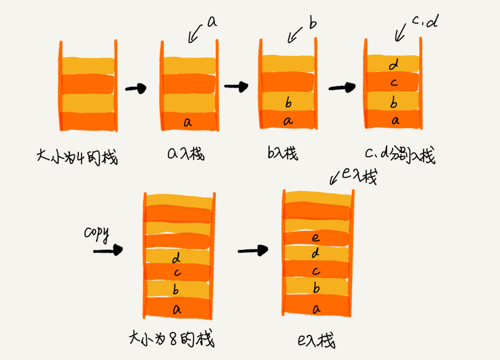
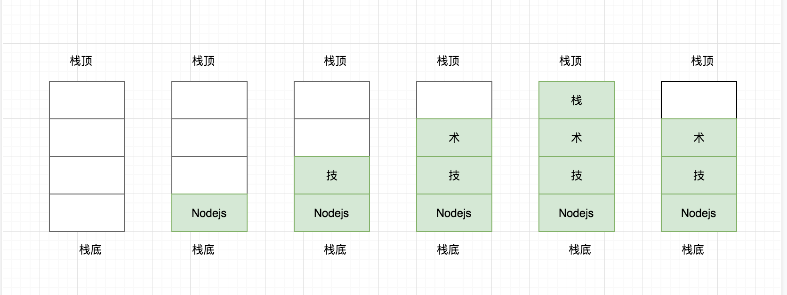
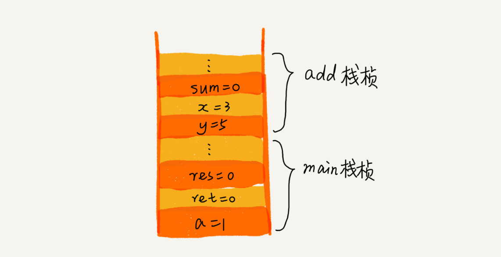
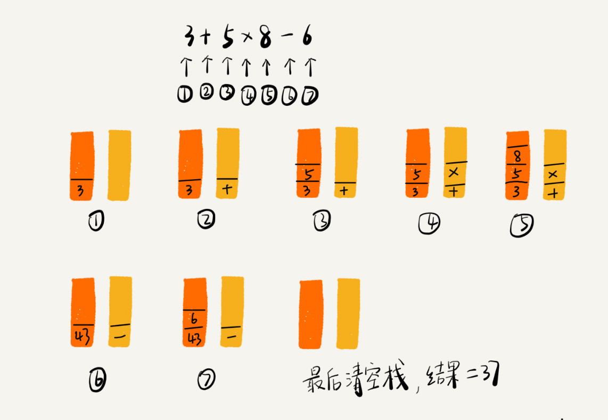
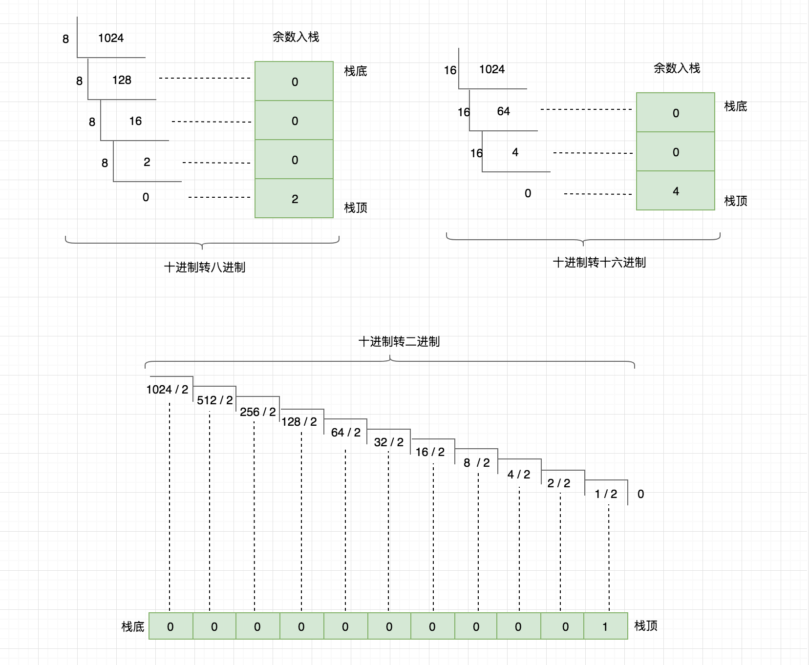

# 栈篇

栈，英文 Last In First Out 简称 LIFO，遵从后进先出的原则，与 “队列” 相反，在栈的头部添加元素、删除元素，如果栈中没有元素就称为空栈。

## 栈简介

在现实生活场景中也很多例子，例如盘子叠放，从上面一个一个放置，取时也是从上面一个一个拿走，不可能从下面直接抽着拿，如下图所示



这也是栈的典型应用，通过这个例子也可总结出栈的两个特性：

1. 仅能从栈顶端存取数据
2. 数据存取遵从后进先出原则

## 如何实现一个“栈”？

栈既可以用数组来实现，也可以用链表来实现。用数组实现的栈，我们叫作顺序栈，用链表实现的栈，我们叫作链式栈。
不管是顺序栈还是链式栈，入栈、出栈只涉及栈顶个别数据的操作，所以时间复杂度都是 O(1)



```java

// 基于数组实现的顺序栈
public class ArrayStack {
  private String[] items;  // 数组
  private int count;       // 栈中元素个数
  private int n;           //栈的大小

  // 初始化数组，申请一个大小为n的数组空间
  public ArrayStack(int n) {
    this.items = new String[n];
    this.n = n;
    this.count = 0;
  }

  // 入栈操作
  public boolean push(String item) {
    // 数组空间不够了，直接返回false，入栈失败。
    if (count == n) return false;
    // 将item放到下标为count的位置，并且count加一
    items[count] = item;
    ++count;
    return true;
  }
  
  // 出栈操作
  public String pop() {
    // 栈为空，则直接返回null
    if (count == 0) return null;
    // 返回下标为count-1的数组元素，并且栈中元素个数count减一
    String tmp = items[count-1];
    --count;
    return tmp;
  }
}
```
### 支持动态扩容的顺序栈



均摊时间复杂度一般都等于最好情况时间复杂度。因为在大部分情况下，入栈操作的时间复杂度 O 都是 O(1)，只有在个别时刻才会退化为 O(n)，所以把耗时多的入栈操作的时间均摊到其他入栈操作上，平均情况下的耗时就接近 O(1)。


下面通过一张图展示以上程序的入栈、出栈过程




**栈在函数调用中的应用**



**栈在表达式求值中的应用**



### 十进制转换为二进制、八进制、十六进制

现在生活中我们使用最多的是十进制来表示，也是人们最易懂和记得的，但是计算机在处理的时候就要转为二进制进行计算，在十进制与二进制的转换过程之间一般还会用八进制或者十六进制作为二进制的缩写。

因此，这里主要讲解十进制、八进制、十六进制、二进制转换过程中在栈中的实际应用。首先你需要先了解这几种数据类型之间的转换规则，也不难通过一张图来告诉你。



上图中我们用十进制整除需要转换的数据类型(二进制、八进制、十六进制)，将余数放入栈中，明白这个原理在用代码实现就很简单了。