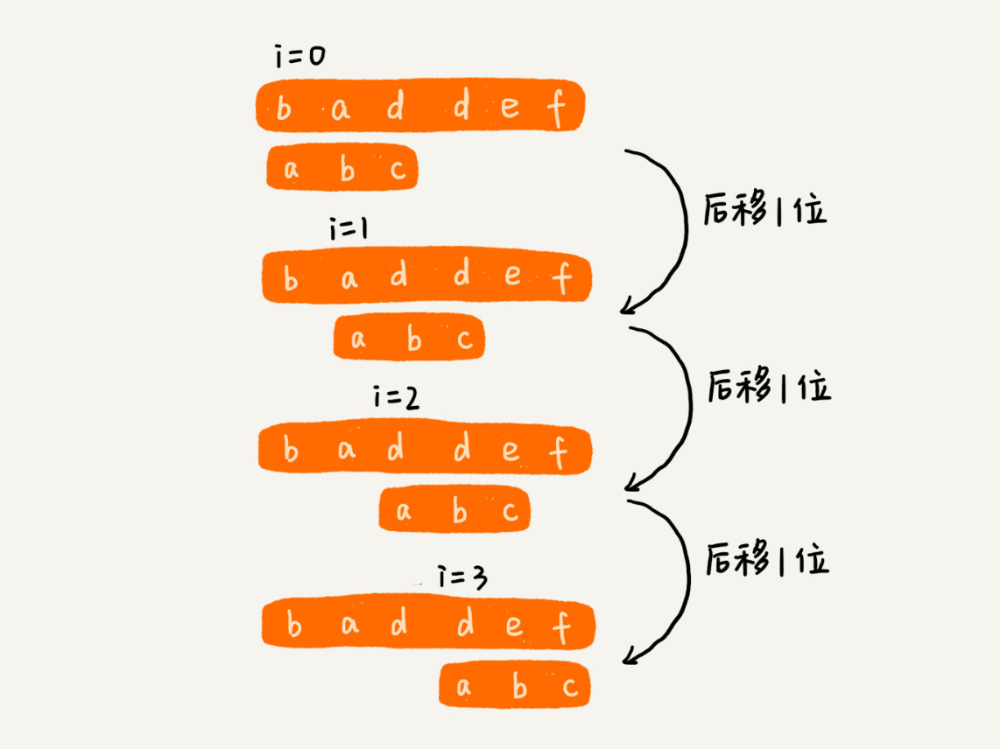
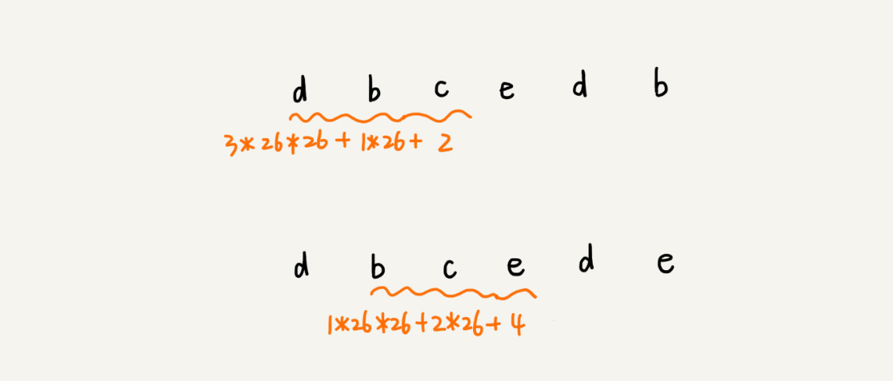
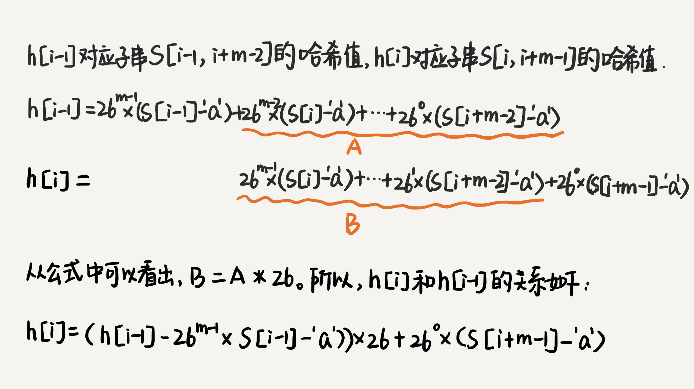
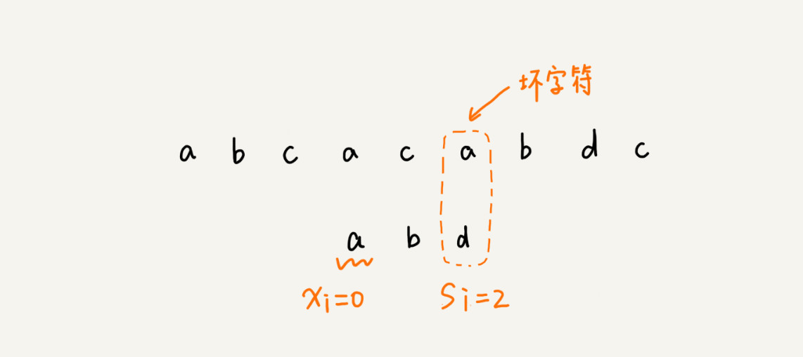

# 字符串匹配

#BF 算法
BF 算法中的 BF 是 Brute Force 的缩写，中文叫作暴力匹配算法，也叫朴素匹配算法。
时间复杂度O(n*m)


#RK 算法

我们通过哈希算法对主串中的 n-m+1 个子串分别求哈希值，然后逐个与模式串的哈希值比较大小。如果某个子串的哈希值与模式串相等，那就说明对应的子串和模式串匹配了
时间复杂度O(n)



#BM 算法
##坏字符规则（bad character rule）

根据 si-xi 计算出来的移动位数

##好后缀规则（good suffix shift）

```go
const SIZE = 256
func bm(a []byte, n int, b []byte, m int)int {
	bc := make([]int, SIZE)
	generateBC(b, m, bc)

	suffix:=make([]int,m)
	prefix:=make([]bool,m)
	generateGS(b, m, suffix, prefix)
	i:=0
	for i<n-m{
		j:=m-1
		for a[i+j]==b[j]{
			j--
		}
		if j<0{
			return i
		}
		x:=j-bc[a[i+j]]
		y:=0
		if j<m-1{// 如果有好后缀的话
			y = moveByGS(j, m, suffix, prefix);
		}
		i+=min(x,y)
	}
	return -1
}
func moveByGS( j int ,  m int, suffix []int, prefix []bool)int  {
	k:=m-1-j//// 好后缀长度
	if suffix[k]!=-1{
		return j-suffix[k]+1
	}
	for r := j+2; r <=m-1 ; r++ {
		if prefix[m-r]==true{
			return r
		}
	}
	return m
}
func generateGS(b []byte, m int, suffix []int,prefix []bool)  {
	for i := 0; i <m ; i++ {
		suffix[i]=-1
		prefix[i]=false
	}
	for i := 0; i <m-1 ; i++ {
		j:=i
		k:=0
		for j>=0&&b[j]==b[m-1-k]{
			j--
			k++
			suffix[k]=j+1
		}
		if j==-1{
			prefix[k]=true
		}
	}
}
func generateBC(b []byte, m int, bc []int) {
	for i := 0; i < SIZE; i++ {
		bc[i] = -1
	}
	for i := 0; i < m; i++ {
		bc[b[i]-'a'] = i
	}
}
```

##KMP

