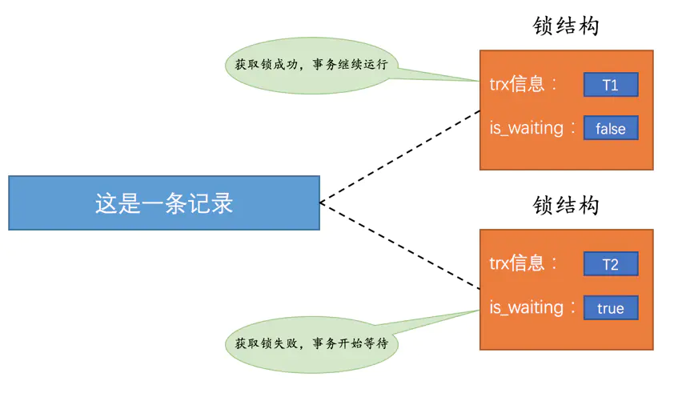

# lock


锁结构里有很多信息，不过为了简化理解，我们现在只把两个比较重要的属性拿了出来：
- trx信息：代表这个锁结构是哪个事务生成的。
- is_waiting：代表当前事务是否在等待。


# 解决并发事务带来问题的两种基本方式
## 并发事务访问相同记录的情况大致可以划分为3种
- 读-读情况：即并发事务相继读取相同的记录

    读取操作本身不会对记录有一毛钱影响，并不会引起什么问题，所以允许这种情况的发生。
- 写-写情况：即并发事务相继对相同的记录做出改动。

    在这种情况下会发生脏写的问题，任何一种隔离级别都不允许这种问题的发生。所以在多个未提交事务相继对一条记录做改动时，需要让它们排队执行，这个排队的过程其实是通过锁来实现的。
- 读-写或写-读情况：也就是一个事务进行读取操作，另一个进行改动操作。

    这种情况下可能发生脏读、不可重复读、幻读的问题
    
    >小贴士： 幻读问题的产生是因为某个事务读了一个范围的记录，之后别的事务在该范围内插入了新记录，该事务再次读取该范围的记录时，可以读到新插入的记录，所以幻读问题准确的说并不是因为读取和写入一条相同记录而产生的，这一点要注意一下。
      

SQL标准规定不同隔离级别下可能发生的问题不一样：

- 在READ UNCOMMITTED隔离级别下，脏读、不可重复读、幻读都可能发生。

- 在READ COMMITTED隔离级别下，不可重复读、幻读可能发生，脏读不可以发生。

- 在REPEATABLE READ隔离级别下，幻读可能发生，脏读和不可重复读不可以发生。

- 在SERIALIZABLE隔离级别下，上述问题都不可以发生。

不过各个数据库厂商对SQL标准的支持都可能不一样，与SQL标准不同的一点就是，MySQL在REPEATABLE READ隔离级别实际上就已经解决了幻读问题。

## 怎么解决脏读、不可重复读、幻读这些问题呢？
- 方案一：读操作利用多版本并发控制（MVCC），写操作进行加锁。

    所谓的MVCC我们在前一章有过详细的描述，就是通过生成一个ReadView，然后通过ReadView找到符合条件的记录版本（历史版本是由undo日志构建的），其实就像是在生成ReadView的那个时刻做了一次时间静止（就像用相机拍了一个快照），查询语句只能读到在生成ReadView之前已提交事务所做的更改，在生成ReadView之前未提交的事务或者之后才开启的事务所做的更改是看不到的。而写操作肯定针对的是最新版本的记录，读记录的历史版本和改动记录的最新版本本身并不冲突，也就是采用MVCC时，读-写操作并不冲突。
    >小贴士： 我们说过普通的SELECT语句在READ COMMITTED和REPEATABLE READ隔离级别下会使用到MVCC读取记录。在READ COMMITTED隔离级别下，一个事务在执行过程中每次执行SELECT操作时都会生成一个ReadView，ReadView的存在本身就保证了事务不可以读取到未提交的事务所做的更改，也就是避免了脏读现象；REPEATABLE READ隔离级别下，一个事务在执行过程中只有第一次执行SELECT操作才会生成一个ReadView，之后的SELECT操作都复用这个ReadView，这样也就避免了不可重复读和幻读的问题。
- 方案二：读、写操作都采用加锁的方式。

    如果我们的一些业务场景不允许读取记录的旧版本，而是每次都必须去读取记录的最新版本，比方在银行存款的事务中，你需要先把账户的余额读出来，然后将其加上本次存款的数额，最后再写到数据库中。在将账户余额读取出来后，就不想让别的事务再访问该余额，直到本次存款事务执行完成，其他事务才可以访问账户的余额。这样在读取记录的时候也就需要对其进行加锁操作，这样也就意味着读操作和写操作也像写-写操作那样排队执行。
    > 小贴士： 我们说脏读的产生是因为当前事务读取了另一个未提交事务写的一条记录，如果另一个事务在写记录的时候就给这条记录加锁，那么当前事务就无法继续读取该记录了，所以也就不会有脏读问题的产生了。不可重复读的产生是因为当前事务先读取一条记录，另外一个事务对该记录做了改动之后并提交之后，当前事务再次读取时会获得不同的值，如果在当前事务读取记录时就给该记录加锁，那么另一个事务就无法修改该记录，自然也不会发生不可重复读了。我们说幻读问题的产生是因为当前事务读取了一个范围的记录，然后另外的事务向该范围内插入了新记录，当前事务再次读取该范围的记录时发现了新插入的新记录，我们把新插入的那些记录称之为幻影记录。采用加锁的方式解决幻读问题就有那么一丢丢麻烦了，因为当前事务在第一次读取记录时那些幻影记录并不存在，所以读取的时候加锁就有点尴尬 —— 因为你并不知道给谁加锁，没关系，这难不倒设计InnoDB的大叔的，我们稍后揭晓答案，稍安勿躁。

                                                                                                                                                                                                                                 
很明显，采用MVCC方式的话，读-写操作彼此并不冲突，性能更高，采用加锁方式的话，读-写操作彼此需要排队执行，影响性能。一般情况下我们当然愿意采用MVCC来解决读-写操作并发执行的问题，但是业务在某些特殊情况下，要求必须采用加锁的方式执行，那也是没有办法的事。

## 一致性读（Consistent Reads）

事务利用MVCC进行的读取操作称之为一致性读，或者一致性无锁读，有的地方也称之为快照读。所有普通的SELECT语句（plain SELECT）在READ COMMITTED、REPEATABLE READ隔离级别下都算是一致性读，比方说：
```mysql
SELECT * FROM t;
SELECT * FROM t1 INNER JOIN t2 ON t1.col1 = t2.col2
```  
一致性读并不会对表中的任何记录做加锁操作，其他事务可以自由的对表中的记录做改动。

## 锁定读（Locking Reads）

### 共享锁和独占锁

在使用加锁的方式解决问题时，由于既要允许读-读情况不受影响，又要使写-写、读-写或写-读情况中的操作相互阻塞，所以设计MySQL给锁分了个类：

- 共享锁，英文名：Shared Locks，简称S锁。在事务要读取一条记录时，需要先获取该记录的S锁。

- 独占锁，也常称排他锁，英文名：Exclusive Locks，简称X锁。在事务要改动一条记录时，需要先获取该记录的X锁。

兼容性 | x|s|
---|---|---|
x |	不兼容|不兼容
s | 不兼容|兼容

### 锁定读的语句

   我们前边说在采用加锁方式解决脏读、不可重复读、幻读这些问题时，读取一条记录时需要获取一下该记录的S锁，其实这是不严谨的，有时候想在读取记录时就获取记录的X锁，来禁止别的事务读写该记录，为此设计MySQL的大叔提出了两种比较特殊的SELECT语句格式：

- 对读取的记录加S锁：
```mysql
SELECT ... LOCK IN SHARE MODE;
```

    
   也就是在普通的SELECT语句后边加LOCK IN SHARE MODE，如果当前事务执行了该语句，那么它会为读取到的记录加S锁，这样允许别的事务继续获取这些记录的S锁（比方说别的事务也使用SELECT ... LOCK IN SHARE MODE语句来读取这些记录），但是不能获取这些记录的X锁（比方说使用SELECT ... FOR UPDATE语句来读取这些记录，或者直接修改这些记录）。如果别的事务想要获取这些记录的X锁，那么它们会阻塞，直到当前事务提交之后将这些记录上的S锁释放掉。

- 对读取的记录加X锁：
```mysql
SELECT ... FOR UPDATE;
```

    
   也就是在普通的SELECT语句后边加FOR UPDATE，如果当前事务执行了该语句，那么它会为读取到的记录加X锁，这样既不允许别的事务获取这些记录的S锁（比方说别的事务使用SELECT ... LOCK IN SHARE MODE语句来读取这些记录），也不允许获取这些记录的X锁（比如说使用SELECT ... FOR UPDATE语句来读取这些记录，或者直接修改这些记录）。如果别的事务想要获取这些记录的S锁或者X锁，那么它们会阻塞，直到当前事务提交之后将这些记录上的X锁释放掉。

## 写操作

平常所用到的写操作无非是DELETE、UPDATE、INSERT这三种：

- DELETE：

    对一条记录做DELETE操作的过程其实是先在B+树中定位到这条记录的位置，然后获取一下这条记录的X锁，然后再执行delete mark操作。我们也可以把这个定位待删除记录在B+树中位置的过程看成是一个获取X锁的锁定读。

- UPDATE：
    
  在对一条记录做UPDATE操作时分为三种情况：
  
  -  如果未修改该记录的键值并且被更新的列占用的存储空间在修改前后未发生变化，则先在B+树中定位到这条记录的位置，然后再获取一下记录的X锁，最后在原记录的位置进行修改操作。其实我们也可以把这个定位待修改记录在B+树中位置的过程看成是一个获取X锁的锁定读。
  
  -  如果未修改该记录的键值并且至少有一个被更新的列占用的存储空间在修改前后发生变化，则先在B+树中定位到这条记录的位置，然后获取一下记录的X锁，将该记录彻底删除掉（就是把记录彻底移入垃圾链表），最后再插入一条新记录。这个定位待修改记录在B+树中位置的过程看成是一个获取X锁的锁定读，新插入的记录由INSERT操作提供的隐式锁进行保护。
  
  - 如果修改了该记录的键值，则相当于在原记录上做DELETE操作之后再来一次INSERT操作，加锁操作就需要按照DELETE和INSERT的规则进行了。
 
- INSERT：

    一般情况下，新插入一条记录的操作并不加锁，使用隐式锁保护这条新插入的记录在本事务提交前不被别的事务访问， 

                                                                                                                                                                                                                                                                                                                                                                                                                                                        

 

