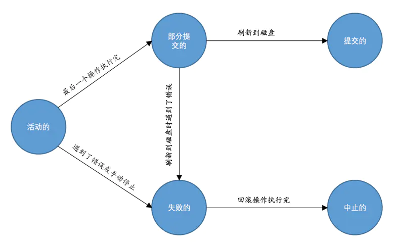

# mysql事务

# 事务的特性

- 原子性（Atomicity）
- 隔离性（Isolation）
- 一致性（Consistency）
- 持久性（Durability）

# 事务运行的不同阶段

  

# mysql中的事务

## 支持事务的存储引擎

innodb

## 自动提交

MySQL中有一个系统变量autocommit：
默认值为ON，也就是说默认情况下，如果我们不显式的使用START TRANSACTION或者BEGIN语句开启一个事务，那么每一条语句都算是一个独立的事务，这种特性称之为事务的自动提交。

关闭这种自动提交的功能，可以使用下边两种方法之一：

- 显式的的使用START TRANSACTION或者BEGIN语句开启一个事务。

- 这样在本次事务提交或者回滚前会暂时关闭掉自动提交的功能。
把系统变量autocommit的值设置为OFF

## 隐式提交

- 定义或修改数据库对象的数据定义语言（Data definition language，缩写为：DDL）

- 隐式使用或修改mysql数据库中的表

    当我们使用ALTER USER、CREATE USER、DROP USER、GRANT、RENAME USER、REVOKE、SET PASSWORD等语句时也会隐式的提交前边语句所属于的事务。
    
- 事务控制或关于锁定的语句

- 加载数据的语句

- 关于MySQL复制的一些语句

## 保存点savepoint

