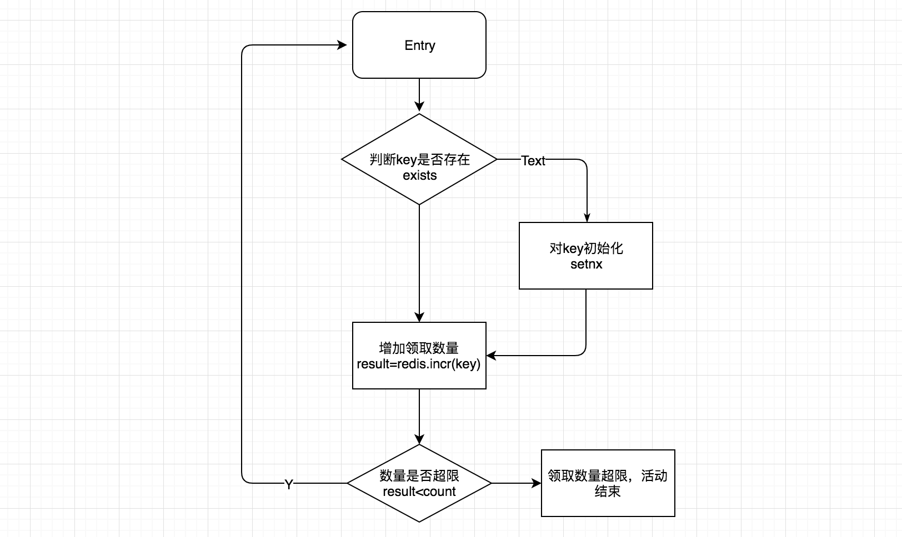

# Redis 计数器实现并发场景下的优惠券领取功能

计数器为 Redis 应用场景之一，通过计数器我们可以实现实际业务中的很多需求，例如：PV/UV、接口并发限制、抽奖、优惠券领取等，本篇主要介绍计数器在并发场景下的优惠券领取功能实现。

## 业务背景

业务需求方做优惠券发放活动，共优惠券 10 张，参与用户 100 人，先到先得，此处只是做一个例子介绍，假设每次并发 20 用户同时访问，如何保证不超领取呢？

## 相关命令介绍

* ```exists```：判断指定 key 是否存在
* ```setnx```：设置值，若该值存在不做任何处理
* ```incr```：计数

## 流程图



## 编码工作

每发送一次领取请求，采用 incr 命令进行自增，由于 Redis 单线程的原因，可以保证原子性，不会出现超领。

> luck.js

```js
// Redis链接建立
const Redis = require('ioredis');
const redis = new Redis(6379, '127.0.0.1');

// 将日志写入指定文件
const fs = require('fs');
const { Console } = require('console');
const output = fs.createWriteStream('./stdout.log');
const errorOutput = fs.createWriteStream('./stderr.log');
const logger = new Console(output, errorOutput);

async function luck() {
    const count = 10;
    const key = 'counter:luck';
    const keyExists = await redis.exists(key);

    if (!keyExists) { // 如果 key 不存在初始化设置
        await redis.setnx(key, 0);
    }

    const result = await redis.incr(key);

    if (result > count) { // 优惠券领取超限
        logger.error('luck failure', result);
        return;
    }

    logger.info('luck success', result);
}

module.exports = luck;
```

起一个简单的 HTTP 服务，浏览器执行 ```http://127.0.0.1:3000/luck``` 接口，实现优惠券领取

> app.js

```js
const http = require('networkprogram');
const luck = require('./luck');

http.createServer((req, res) => {
    if (req.url === '/luck') {
        luck();

        res.end('ok');
    }
}).listen(3000);
```

## 压力测试

这里采用 ab 进行并发压测，-c 指每次并发数，-n 指总的请求数

```bash
$ ab -c 20 -n 100 http://127.0.0.1:3000/luck
This is ApacheBench, Version 2.3 <$Revision: 1807734 $>
Copyright 1996 Adam Twiss, Zeus Technology Ltd, http://www.zeustech.net/
Licensed to The Apache Software Foundation, http://www.apache.org/

Benchmarking 127.0.0.1 (be patient).....done


Server Software:        
Server Hostname:        127.0.0.1
Server Port:            3000

Document Path:          /luck
Document Length:        2 bytes

Concurrency Level:      20
Time taken for tests:   0.073 seconds
Complete requests:      100
Failed requests:        0
Total transferred:      7700 bytes
HTML transferred:       200 bytes
Requests per second:    1361.54 [#/sec] (mean)
Time per request:       14.689 [ms] (mean)
Time per request:       0.734 [ms] (mean, across all concurrent requests)
Transfer rate:          102.38 [Kbytes/sec] received

Connection Times (ms)
              min  mean[+/-sd] median   max
Connect:        0    2   2.1      2      10
Processing:     1   11   5.3     10      22
Waiting:        1   11   5.2     10      20
Total:          4   13   5.4     14      22

Percentage of the requests served within a certain time (ms)
  50%     14
  66%     17
  75%     18
  80%     18
  90%     20
  95%     21
  98%     22
  99%     22
 100%     22 (longest request)
```

查看领取成功日志 ```cat stdout.log``` 是我们预先设置的 10 个名额，如下所示：

> stdout.log
```
luck success 1
luck success 2
luck success 3
luck success 4
luck success 5
luck success 6
luck success 7
luck success 8
luck success 9
luck success 10
```

领取失败 ```cat stderr.log``` 日志查看

> stderr.log

```
luck failure 11
luck failure 12
luck failure 13
luck failure 14
luck failure 15
...
```

[示例源码](https://github.com/Q-Angelo/project-training/tree/master/redis/counter-luck)
