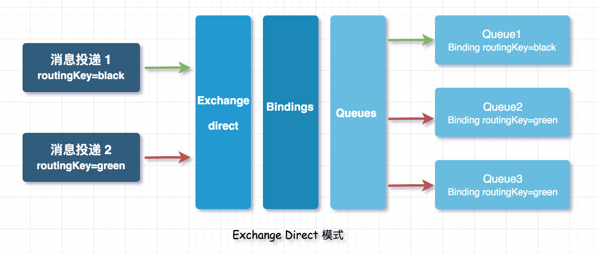
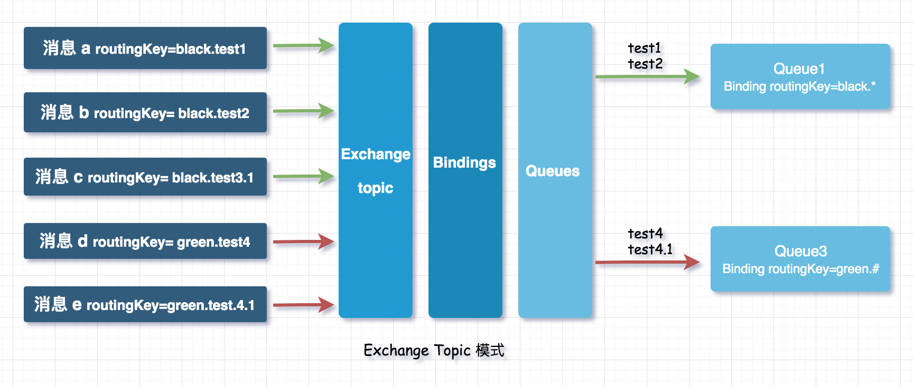
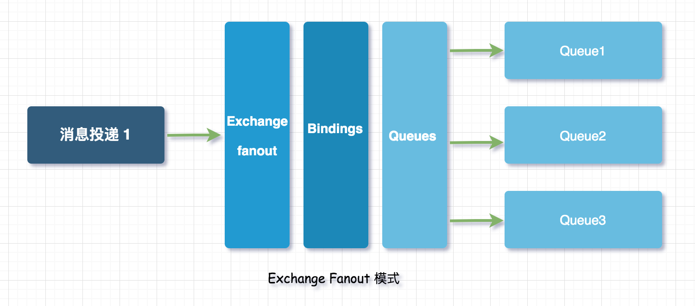

# 图文实践 RabbitMQ 不同类型交换机消息投递机制

生产者发布消息、消费者接收消息，但是这中间的消息是怎么传递的，就用到了一个很重要的概念**交换机（Exchange）**，RabbitMQ 消息投递到交换机上之后，通过路由关系再投递到指定的一个或多个队列上。本文通过图文实践来讲解 RabbitMQ 不同交换机类型的消息投递机制。

## 交换机初步认识

交换机有四种类型，每种类型有不同的路由策略，这块也是入门的难点，在初学的过程中对消息的路由机制也是一直不是很理解，本文通过实践总结对不同类型交换机的路由策略分别进行了讲解。

**Exchange 参数介绍**
- Name：交换机名称
- Type：交换机类型 direct、topic、fanout、headers
- Durability：是否需要持久化
- Auto Delete：最后一个绑定到 Exchange 上的队列删除之后自动删除该 Exchange
- Internal：当前 Exchange 是否应用于 RabbitMQ 内部使用，默认false。
- Arguments：扩展参数

**Exchange 四种类型**
- direct：不需要 Exchange 进行绑定，根据 RoutingKey 匹配消息路由到指定的队列。
- topic：生产者指定 RoutingKey 消息根据消费端指定的队列通过模糊匹配的方式进行相应转发，两种通配符模式：
    * `#`：可匹配一个或多个关键字
    * `*`：只能匹配一个关键字
- fanout：这种模式只需要将队列绑定到交换机上即可，是不需要设置路由键的。
- headers：根据发送消息内容中的 headers 属性来匹配

## 交换机类型之 direct

direct 通过 RoutingKey 匹配消息路由到指定的队列，因此也可以无需指定交换机，在不指定交换机的情况下会使用 ```AMQP default``` 默认的交换机，另外在消息投递时要注意 RoutingKey 要完全匹配才能被队列所接收，否则消息会被丢弃的。



上图三个队列，第一个队列的 Binding routingKey 为 black，第二个队列和第三个队列的 Binding routingKey 为 green 和 green，也很清晰的能看到消息投递 1 仅被 Queue1 接收，而 消息投递 2 同时可以被广播到 Queue2 和 Queue3，这是因为 Queue2 和 Queue3 的路由键是相同的，再一次的说明了**交换机的 direct 模式是通过 RoutingKey 进行消息路由的**。

**构建生产者**

```js
const amqp = require('amqplib');

async function producer() {
    // 创建链接对象
    const connection = await amqp.connect('amqp://localhost:5672');

    // 获取通道
    const channel = await connection.createChannel();

    // 声明参数
    const exchangeName = 'direct_exchange_name';
    const routingKey = 'direct_routingKey';
    const msg = 'hello world';

    // 交换机
    await channel.assertExchange(exchangeName, 'direct', {
        durable: true,
    });

    // 发送消息
    await channel.publish(exchangeName, routingKey, Buffer.from(msg));

    // 关闭链接
    await channel.close();
    await connection.close();
}

producer();
```

**构建消费者**

```js
const amqp = require('amqplib');

async function consumer() {
    // 创建链接对象
    const connection = await amqp.connect('amqp://localhost:5672');

    // 获取通道
    const channel = await connection.createChannel();

    // 声明参数
    const exchangeName = 'direct_exchange_name';
    const queueName = 'direct_queue';
    const routingKey = 'direct_routingKey';

    // 声明一个交换机
    await channel.assertExchange(exchangeName, 'direct', { durable: true });

    // 声明一个队列
    await channel.assertQueue(queueName);

    // 绑定关系（队列、交换机、路由键）
    await channel.bindQueue(queueName, exchangeName, routingKey);

    // 消费
    await channel.consume(queueName, msg => {
        console.log('Consumer：', msg.content.toString());
        channel.ack(msg);
    });

    console.log('消费端启动成功！');
}

consumer();
```

**源码地址**

```
https://github.com/Q-Angelo/project-training/tree/master/rabbitmq/helloworld-direct
```

## 交换机类型之 topic

生产者指定 RoutingKey ，消费端根据指定的队列通过模糊匹配的方式进行相应转发，两种通配符模式如下：
* `#`：可匹配一个或多个关键字
* `*`：只能匹配一个关键字



上图展示了交换机 Topic 模式的消息流转过程，Queue1 的路由键通过使用 **```*```** 符合匹配到了 black.test1 和 black.test2 但是 black.test3.1 由于有多个关键字是匹配不到的。另一个队列 Queue2 使用了 **```#```** 符号即可以一个也可以匹配多个关键字，同时匹配到了 black.test4 和 black.test5.1。

**构建生产者**

```js
const amqp = require('amqplib');

async function producer() {
    // 创建链接对象
    const connection = await amqp.connect('amqp://localhost:5672');

    // 获取通道
    const channel = await connection.createChannel();

    /** 改造部分 */
    // 声明参数
    const exchangeName = 'topic_exchange_name';
    const routingKey1 = 'topic_routingKey.test1';
    const routingKey2 = 'topic_routingKey.test2';
    const routingKey3 = 'topic_routingKey.test3.1';
    const routingKey4 = 'topic_routingKey2.test4';
    const routingKey5 = 'topic_routingKey2.test5.1';
    const msg = 'hello world';

    // 交换机
    await channel.assertExchange(exchangeName, 'topic', {
        durable: true,
    });

    // 发送消息
    await channel.publish(exchangeName, routingKey1, Buffer.from(msg + routingKey1));
    await channel.publish(exchangeName, routingKey2, Buffer.from(msg + routingKey2));
    await channel.publish(exchangeName, routingKey3, Buffer.from(msg + routingKey3));
    await channel.publish(exchangeName, routingKey4, Buffer.from(msg + routingKey4));
    await channel.publish(exchangeName, routingKey5, Buffer.from(msg + routingKey5));
    /** 改造部分 */

    // 关闭链接
    await channel.close();
    await connection.close();
}

producer();
```

**构建消费者1**

由于和 direct 模式是相同的，仅列出改动部分

```js
...
// 使用 * 符号
const routingKey = 'topic_routingKey.*';

// 声明一个交换机
await channel.assertExchange(exchangeName, 'topic', { durable: true });
...
```

**构建消费者2**

```js
// 使用 # 符号
const routingKey = 'topic_routingKey2.#';

// 声明一个交换机
await channel.assertExchange(exchangeName, 'topic', { durable: true });
```

**源码地址**

```
https://github.com/Q-Angelo/project-training/tree/master/rabbitmq/helloworld-topic
```

## 交换机类型之 fanout

与 direct 和 topic 两种类型不同的是这种模式只需要将队列绑定到交换机上即可，是不需要设置路由键的，便可将消息转发到绑定的队列上，正式由于不需要路由键，所以 fanout 也是四个交换机类型中最快的一个，如果是做广播模式的就很适合。

下图展示了 fanout 类型交换机的消息流转过程



**构建生产者**

只需要设置交换机类型为 fanout 即可，路由键无为空，设置了也是不会生效的

```js
...
// 声明参数
const exchangeName = 'fanout_exchange_name';
const routingKey = '';
const msg = 'hello world';

// 交换机
await channel.assertExchange(exchangeName, 'fanout', {
    durable: true,
});
...
```

**构建消费者**

```js
// 声明参数
const exchangeName = 'fanout_exchange_name';
const queueName = 'fanout_queue';
const routingKey = '';

// 声明一个交换机
await channel.assertExchange(exchangeName, 'fanout', { durable: true });
```

**源码地址**

```
https://github.com/Q-Angelo/project-training/tree/master/rabbitmq/helloworld-fanout
```


## 交换机类型之 headers

该类型的交换机是根据发送消息内容中的 headers 属性来匹配的，headers 类型的交换机基本上不会用到，因此这里也不会过多介绍，掌握以上三种类型的交换机模型在平常的业务场景中就足够了。

## 总结

以上着重介绍了 direct、topic、fanout 三种类型交换机的使用，由于 headers 类型的交换不常用，也没有做过多介绍，在学习的过程中，想要更好的去理解，最好亲自去实践下，这样也会有一个更深刻的理解。