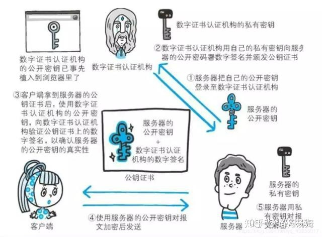

# HTTP和HTTPS

## 几个概念
### URI和URL的区别
- URI：Uniform Resource Identifier 统一资源标识符
- URL：Uniform Resource Location 统一资源定位符
> URI 是用来标示 一个具体的资源的，我们可以通过 URI 知道一个资源是什么。
> URL 则是用来定位具体的资源的，标示了一个具体的资源位置。互联网上的每个文件都有一个唯一的URL。

### 网关：Gateway
>一个作为其它服务器中间媒介的服务器。与代理不同的是，网关接受请求就好象对被请求的资源来说它就是源服务器；发出请求的客户机并没有意识到它在同网关打交道。
### 通道：Tunnel
>是作为两个连接中继的中介程序。一旦激活，通道便被认为不属于HTTP通讯，尽管通道可能是被一个HTTP请求初始化的。当被中继的连接两端关闭时，通道便消失

## HTTP

### 介绍（普遍使用版本HTTP 1.1）
> 超文本传输协议，是一个基于请求与响应，无状态的，应用层的协议，常基于TCP/IP协议传输数据，互联网上应用最为广泛的一种网络协议,所有的WWW文件都必须遵守这个标准。设计HTTP的初衷是为了提供一种发布和接收HTML页面的方法。
### HTTP1.1版本新特性
>- 默认持久连接节省通信量，只要客户端服务端任意一端没有明确提出断开TCP连接，就一直保持连接，可以发送多次HTTP请求
>- 管线化，客户端可以同时发出多个HTTP请求，而不用一个个等待响应
>- 断点续传原理
### HTTP/2
- 二进制协议
> HTTP/1.1 版的头信息肯定是文本（ASCII编码），数据体可以是文本，也可以是二进制。HTTP/2 则是一个彻底的二进制协议，头信息和数据体都是二进制，并且统称为"帧"（frame）：头信息帧和数据帧。
- 多工
> HTTP/2 复用TCP连接，在一个连接里，客户端和浏览器都可以同时发送多个请求或回应，而且不用按照顺序一一对应，这样就避免了"队头堵塞"。
>举例来说，在一个TCP连接里面，服务器同时收到了A请求和B请求，于是先回应A请求，结果发现处理过程非常耗时，于是就发送A请求已经处理好的部分， 接着回应B请求，完成后，再发送A请求剩下的部分。
 这样双向的、实时的通信，就叫做多工（Multiplexing）
- 数据流
> HTTP/2 将每个请求或回应的所有数据包，称为一个数据流（stream）。每个数据流都有一个独一无二的编号。数据包发送的时候，都必须标记数据流ID，用来区分它属于哪个数据流。另外还规定，客户端发出的数据流，ID一律为奇数，服务器发出的，ID为偶数。
>客户端还可以指定数据流的优先级。优先级越高，服务器就会越早回应
- 头信息压缩
>HTTP 协议不带有状态，每次请求都必须附上所有信息。所以，请求的很多字段都是重复的，比如Cookie和User Agent，一模一样的内容，每次请求都必须附带，这会浪费很多带宽，也影响速度。
 HTTP/2 对这一点做了优化，引入了头信息压缩机制（header compression）。一方面，头信息使用gzip或compress压缩后再发送；另一方面，客户端和服务器同时维护一张头信息表，所有字段都会存入这个表，生成一个索引号，以后就不发送同样字段了，只发送索引号，这样就提高速度了。
- 服务器推送
>HTTP/2 允许服务器未经请求，主动向客户端发送资源，这叫做服务器推送（server push）。
- 缺点：多个HTTP流使用同一个TCP连接，遵守同一个流量状态控制。只要第一个HTTP流遭遇到拥塞，剩下的HTTP流压根没法发出去，这就是头部阻塞（Head of line Blocking）。

### QUIC
>这个就是Google开发QUIC协议，QUIC协议集成了TCP可靠传输机制、TLS安全加密、HTTP /2 流量复用技术，
>- QUIC 支持乱序确认，解决TCP队头阻塞问题
>- QUIC实现连接的无感迁移
>- QUIC减少TCP建立连接的开销
>- QUIC降低TCP重传概率
>- QUIC改进的拥塞控制
>- QUIC比TCP协议更安全
### HTTP/3
>- HTTPS是类似于TCP握手的工作方式，先工作在HTTP1上，通过HTTP1传递交换得到秘钥，然后切换到HTTPS上工作。
> - HTTP2也是基于TLS的，所以HTTP2的工作方式和HTTPS也是同样的过程，需要握手建立TLS连接，只是TLS连接完成后，发送一个HTTP2的连接确认消息，确认后，客户端服务器使用HTTP2进行连接通讯。
>- HTTP3如何工作。首先要建立好HTTP2连接，然后发送HTTP2扩展帧，这个帧包含IP和端口，浏览器收到扩展帧，使用该IP和端口，使用QUIC建立连接，如果成功，断开HTTP2，升级为HTTP3。
 
 ### TLS
 >IETF在SSL 3.0版本的基础上，重新设计并命名了这个协议，其全新的名字为TLS。

### 在TCP/IP协议栈中的位置

>HTTP协议通常承载于TCP协议之上，有时也承载于TLS或SSL协议层之上，这个时候，就成了我们常说的HTTPS。默认HTTP的端口号为80，HTTPS的端口号为443。

### HTTP特点
- 无状态
> 协议对客户端没有状态存储，对事物处理没有记忆能力，比如访问一个网站需要反复登录操作。
- 无连接
> HTTP/1.1之前，由于无状态特点，每次请求都需要通过TCP三次握手四次挥手，和服务器重新建立连接。比如某个客户机在短时间多次请求同一个资源，服务器并不能区别是否已经响应过用户的请求，所以每次需要重新响应请求，需要耗费不必要的时间和流量。
- 基于请求和响应
> 基本的特性，由客户端发起请求，服务端响应。
- 简单快速、灵活。
- 通信使用明文、请求和响应不会对通信方进行确认、无法保护数据的完整性。

>HTTP协议通信流程

### HTTP报文组成:
1、请求行：包括请求方法、URL、协议/版本 
2、请求头(Request Header) 
3、请求正文 

1、状态行 
2、响应头 
3、响应正文 

### HTTP的缺点：
>1、通信使用明文（不加密），内容可能会被窃听。 
 2、不验证通信方的身份，因此有可能遭遇伪装。 
 3、无法证明报文的完整性，所以有可能已遭篡改 
### HTTP请求

#### 请求方法
| 方法 | 描述 | 
| :-----| :----: |
| GET | 请求指定的页面信息，并返回实体主体。 |
| HEAD | 类似于 GET 请求，只不过返回的响应中没有具体的内容，用于获取报头 | 
| POST | 向指定资源提交数据进行处理请求（例如提交表单或者上传文件）。数据被包含在请求体中。 | 
| PUT | 从客户端向服务器传送的数据取代指定的文档的内容。 | 
| DELETE | 请求服务器删除指定的页面。 | 
| OPTIONS | 允许客户端查看服务器的性能。 | 
| PATCH |是对 PUT 方法的补充，用来对已知资源进行局部更新 。| 
#### post和get的区别：
>- get参数通过url传递，post放在request body中。
>- get请求在url中传递的参数是有长度限制的，而post没有。
>- get比post更不安全，因为参数直接暴露在url中，所以不能用来传递敏感信息。
>- get请求只能进行url编码，而post支持多种编码方式
>- get请求参数会被完整保留在浏览历史记录里，而post中的参数不会被保留。
>- GET和POST本质上就是TCP链接，并无差别。但是由于HTTP的规定和浏览器/服务器的限制，导致他们在应用过程中体现出一些不同
>- GET产生一个TCP数据包；POST产生两个TCP数据包。
>- GET请求会被浏览器主动cache，而POST不会
>- get重点在从服务器上获取资源，post重点在向服务器发送数据；
>- get方式只能支持ASCII字符，向服务器传的中文字符可能会乱码。post支持标准字符集，可以正确传递中文字符。

####  HTTP请求头

### HTTP响应

#### HTTP响应状态码
| 分类 | 分类描述 | 
| :-----| :----: |
| 	1** | 信息，服务器收到请求，需要请求者继续执行操作 |
| 2** | 成功，操作被成功接收并处理 | 
| 3** | 重定向，需要进一步的操作以完成请求 | 
| 4** | 客户端错误，请求包含语法错误或无法完成请求。 | 
| 5** | 服务器错误，服务器在处理请求的过程中发生了错误。 | 

常用状态码

| 状态码 |状态码英文 | 分类描述 | 
| :-----| :----: | :---- |
| 200 |Ok |请求成功。 | 
| 201 |Created | 已创建 | 
| 202 |Accepted | 已接受 | 
| 204 |No Content | 无内容 表示客户端发送给客户端的请求得到了成功处理,没有资源可以返回） | 
| 206 |Patial Content | 部分内容 表示客户端进行了范围请求，并且服务器成功执行了这部分的GET请求，响应报文中包含由Content-Range指定范围的实体内容。 | 
| 301 |Moved Permanently | （永久转移）请求的资源已被永久的移动到新URI | 
| 302 |Found | 	临时移动。与301类似。但资源只是临时被移动。客户端应继续使用原有URI | 
| 303 |See Other | 	（查看其它位置）与302有着相同的含义，表示请求的资源被分配了新的URL，应使用GET方法定向获取请求的资源| 
| 304 |Not Modified | 未修改.所请求的资源未修改，服务器返回此状态码时，不会返回任何资源。 | 
| 307 |Temporary Redirect | 临时重定向，与303有着相同的含义，307会遵照浏览器标准不会从POST变成GET；（不同浏览器可能会出现不同的情况）； | 
| 400 |Bad Request | 客户端请求的语法错误 | 
| 401 |Unauthorized | （没授权）请求要求用户的身份认证 | 
| 403 |Forbidden | 权限禁止访问 | 
| 404 |Not Found | 资源没找到 | 
| 405 |Method Not Allowed | 客户端请求中的方法被禁止 | 
| 408 |Request Time-out | 请求超时 | 
| 500 |Internal Server Error | 服务器内部错误 | 
| 502 |Bad Gateway | 网关错误 | 
| 503 | Server Unavailable | 服务器不可用 | 
| 505 |HTTP Version not supported | http版本不接受 | 

## Cookie和Session
- Cookie和Session都为了用来保存状态信息，都是保存客户端状态的机制，它们都是为了解决HTTP无状态的问题而所做的努力。
- Session可以用Cookie来实现，也可以用URL回写的机制来实现。用Cookie来实现的Session可以认为是对Cookie更高级的应用。
### 两者比较
>- Cookie将状态保存在客户端，Session将状态保存在服务器端；
>- session 的运行依赖 session id，而 session id 是存在 cookie 中的，也就是说，如果浏览器禁用了 cookie ，同时 session 也会失效（但是可以通过其它方式实现，比如在 url 中传递 session_id）
>- cookie不是很安全，别人可以分析存放在本地的cookie并进行cookie欺骗，考虑到安全应当使用session
>- 单个cookie保存的数据不能超过4k,很多浏览器都限制一个站点最多保存20个cookie。
>- session会在一定时间内保存在服务器上。当访问增多，会比较占用你服务器的性能，如果主要考虑到减轻服务器性能方面，应当使用COOKIE ；

## Token机制相对于Cookie机制又有什么好处呢？
- 支持跨域访问:Cookie是不允许垮域访问,这一点对Token机制是不存在的,前提是传输的用户认证信息通过HTTP头传输.
- 无状态(也称：服务端可扩展行):Token机制在服务端不需要存储session信息，因为Token 自身包含了所有登录用户的信息，只需要在客户端的cookie或本地介质存储状态信息.
- 更适用CDN: 可以通过内容分发网络请求你服务端的所有资料（如：javascript，HTML,图片等），而你的服务端只要提供API即可.
- 去耦: 不需要绑定到一个特定的身份验证方案。Token可以在任何地方生成，只要在你的API被调用的时候，你可以进行Token生成调用即可.
- 更适用于移动应用: 当你的客户端是一个原生平台（iOS, Android，Windows 8等）时，Cookie是不被支持的（你需要通过Cookie容器进行处理），这时采用Token认证机制就会简单得多。
- CSRF:因为不再依赖于Cookie，所以你就不需要考虑对CSRF（跨站请求伪造）的防范。
- Token不需要为登录页面做特殊处理 

 

## 断点续传和多线程下载的实现原理
- HTTP协议的GET方法，支持只请求某个资源的某一部分；
- 206 Partial Content 部分内容响应；
- Range 请求的资源范围；
- Content-Range 响应的资源范围；
- 在连接断开重连时，客户端只请求该资源未下载的部分，而不是重新请求整个资源，来实现断点续传。
> 例如 
>分块请求资源实例：
 >- Eg1：Range: bytes=306302- ：请求这个资源从306302个字节到末尾的部分；
 >- Eg2：Content-Range: bytes 306302-604047/604048：响应中指示携带的是该资源的第306302-604047的字节，该资源共604048个字节
客户端通过并发的请求相同资源的不同片段，来实现对某个资源的并发分块下载。从而达到快速下载的目的。目前流行的FlashGet和迅雷基本都是这个原理

多线程下载的原理：
>- 下载工具开启多个发出HTTP请求的线程；
>- 每个http请求只请求资源文件的一部分：Content-Range: bytes 20000-40000/47000；
>- 合并每个线程下载的文件。

## HTTPS通信
>HTTP + 加密 + 认证 + 完整性保护 = HTTPS（HTTP Secure ）

### 什么是HTTPS?
>HTTPS：是以安全为目标的HTTP通道，简单讲是HTTP的安全版，即HTTP下加入SSL层，HTTPS的安全基础是SSL，因此加密的详细内容就需要SSL。 HTTPS协议的主要作用可以分为两种：一种是建立一个信息安全通道，来保证数据传输的安全；另一种就是确认网站的真实性。

>HTTPS 并非是应用层的一种新协议。只是 HTTP 通信接口部分用SSL（Secure Socket Layer）和 TLS（Transport Layer Security）协议代替而已。通常，HTTP 直接和 TCP 通信。当使用 SSL时，则演变成先和 SSL通信，再由 SSL和 TCP 通信了。简言之，所谓 HTTPS，其实就是身披SSL协议这层外壳的 HTTP。
### HTTPS的工作原理：
>- 客户使用https的URL访问Web服务器，要求与Web服务器建立SSL连接。
>- 服务端的配置以及传送证书。Web服务器收到客户端请求后，会将网站的证书信息（证书中包含公钥）传送一份给客户端。
>- 客户端的浏览器与Web服务器开始协商SSL连接的安全等级，也就是信息加密的等级。
>- 客户端的浏览器根据双方同意的安全等级，建立会话密钥，然后利用网站的公钥将会话密钥加密，并传送给网站。
>- Web服务器利用自己的私钥解密出会话密钥。
>- Web服务器利用会话密钥加密与客户端之间的通信。

### 为什么HTTPS安全
- SSL不仅提供加密处理，加密方式为混合加密。
- SSL而且还使用了一种被称为证书的手段，可用于确定方。证书由值得信任的第三方机构颁发，用以证明服务器和客户端是实际存在的。另外，伪造证书从技术角度来说是异常困难的一件事。所以只要能够确认通信方（服务器或客户端）持有的证书。

### 加密方法
>- 对称加密：加密和解密同用一个密钥的方式称为共享密钥加密（Common keycrypto system），也被叫做对称密钥加密.对成加密的方式效率比较低，加密速度慢。典型的对称加密算法有DES、AES等
>- 非对称加密：公开密钥加密使用一对非对称的密钥。一把叫做私有密钥（private key），另一把叫做公开密钥（public key）。顾名思义，私有密钥不能让其他任何人知道，而公开密钥则可以随意发布，任何人都可以获得。公钥加密，私钥解密使用公开密钥加密方式，发送密文的一方使用对方的公开密钥进行加密处理，对方收到被加密的信息后，再使用自己的私有密钥进行解密。典型的非对称加密算法有RSA、DSA等
>- 混合加密
服务器将CA证书发送给客户端，以进行公开密钥加密方式通信。接到证书的客户端可使用数字证书认证机构的公开密钥，对那张证书上的数字签名进行验证，

## http代理
### http代理服务器

对于客户端浏览器而言，http代理服务器相当于服务器。
而对于Web服务器而言，http代理服务器又担当了客户端的角色。

>- 代理服务器英文全称是Proxy Server，其功能就是代理网络用户去取得网络信息。形象的说：它是网络信息的中转站。
>- 代理服务器是介于浏览器和Web服务器之间的一台服务器，有了它之后，浏览器不是直接到Web服务器去取回网页而是向代理服务器发出请求，Request信号会先送到代理服务器，由代理服务器来取回浏览器所需要的信息并传送给你的浏览器。
>- 大部分代理服务器都具有缓冲的功能，就好象一个大的Cache，它有很大的存储空间，它不断将新取得数据储存到它本机的存储器上，如果浏览器所请求的数据在它本机的存储器上已经存在而且是最新的，那么它就不重新从Web服务器取数据，而直接将存储器上的数据传送给用户的浏览器，这样就能显著提高浏览速度和效率。
### http代理服务器的主要功能
>- 突破自身IP访问限制，访问国外站点。
>- 访问一些单位或团体内部资源
>- 突破中国电信的IP封锁
>- 提高访问速度,通常代理服务器都设置一个较大的硬盘缓冲区，当有外界的信息通过时，同时也将其保存到缓冲区中，当其他用户再访问相同的信息时， 则直接由缓冲区中取出信息，传给用户，以提高访问速度；
>- 隐藏真实IP
## 虚拟主机的实现
### 什么是虚拟主机
>是在网络服务器上划分出一定的磁盘空间供用户放置站点、应用组件等，提供必要的站点功能与数据存放、传输功能。  
 

