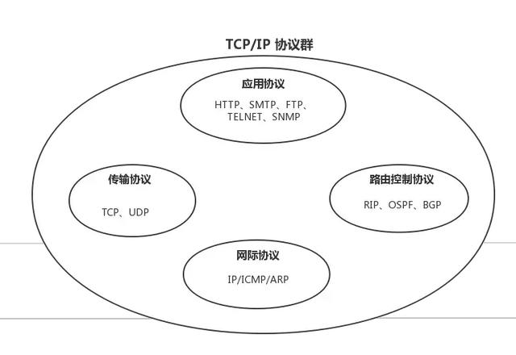
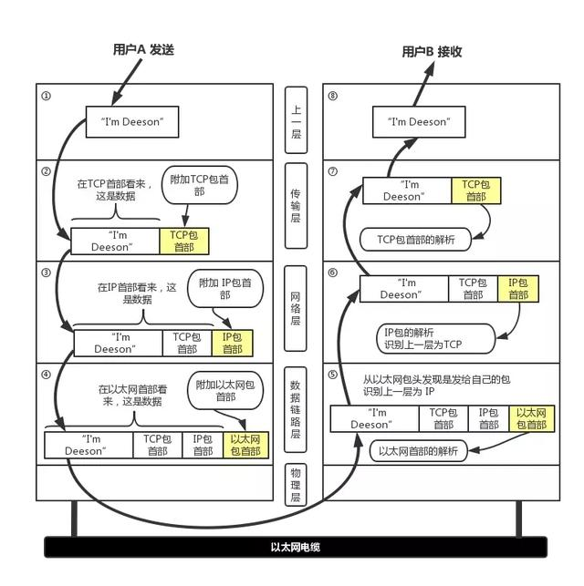
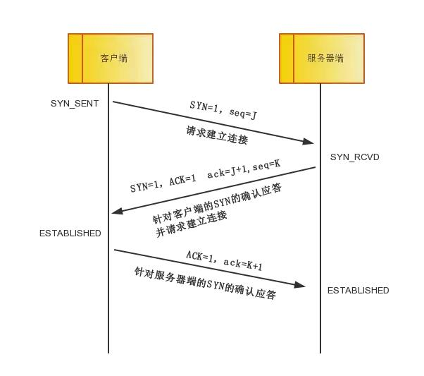
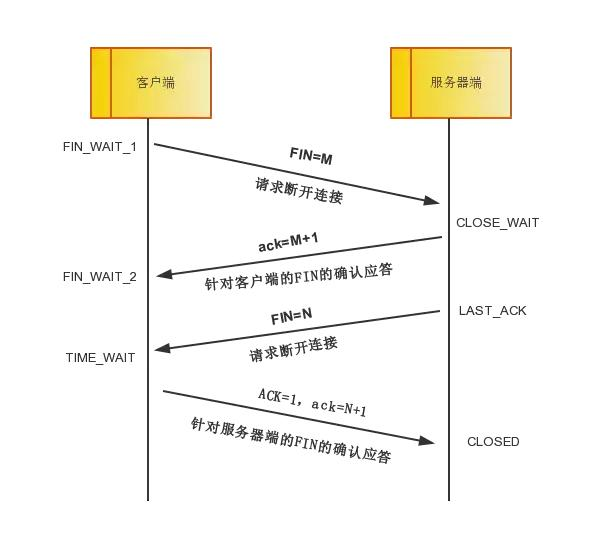

# tcp/ip
[参考文献](https://developer.51cto.com/art/201906/597961.htm)

>TCP/IP协议集包括应用层,传输层，网络层，链路层。
- 应用层
超文本传输协议（HTTP）,文件传输（TFTP简单文件传输协议）,远程登录（Telnet）,网络管理（SNMP简单网络管理协议）,域名系统（DNS）
- 网络层
Internet协议（IP）,Internet控制信息协议（ICMP）,地址解析协议（ARP）,反向地址解析协议（RARP）
- 传输层
TCP UDP

> UDP协议是个不可靠的协议，而TCP协议依靠重传保证可靠协议。
## 端口号
- 根据端口号识别应用
- 通过 IP 地址、端口号、协议号进行通信识别
## UDP
> UDP传输不提供复杂的控制机制，它利用IP提供面向无连接的通信服务。UDP报文没有可靠性保证，顺序保证，和流量控制，可靠性比较差，传输过程中即使出现包丢失也不会重发。 也正是因为这些，它的资源消耗小，传输速度快，通常音频，视频在传送时用UDP传输较多。
## TCP
> TCP是一种面向有连接的传输协议，只有确认通信对端存在时，才会发送数据，从而可以控制通信流量的浪费。同时，TCP还充分实现数据传输过程中的各种控制，可以再数据丢包 的时候重发，还可以对次序乱掉的分包进行顺序控制。
> TCP 为提供可靠性传输，实行“顺序控制”或“重发控制”机制。此外还具备“流控制（流量控制）”、“拥塞控制”、提高网络利用率等众多功能

### TCP三次握手

>- 第一次握手：客户端将标志位SYN置为1，随机产生一个值seq=J，并将该数据包发送给服务器端，客户端进入SYN_SENT状态，等待服务器端确认。
>- 第二次握手：服务器端收到数据包后由标志位SYN=1知道客户端请求建立连接，服务器端将标志位SYN和ACK都置为1，ack=J+1，随机产生一个值seq=K，并将该数据包发送给客户端以确认连接请求，服务器端进入SYN_RCVD状态。
>- 第三次握手：客户端收到确认后，检查ack是否为J+1，ACK是否为1，如果正确则将标志位ACK置为1，ack=K+1，并将该数据包发送给服务器端，服务器端检查ack是否为K+1，ACK是否为1，如果正确则连接建立成功，客户端和服务器端进入ESTABLISHED状态，完成三次握手，随后客户端与服务器端之间可以开始传输数据了。
### TCP四次挥手
- 四次挥手即终止TCP连接，就是指断开一个TCP连接时，需要客户端和服务端总共发送4个包以确认连接的断开。在socket编程中，这一过程由客户端或服务端任一方执行close来触发。
- 由于TCP连接是全双工的，因此，每个方向都必须要单独进行关闭，这一原则是当一方完成数据发送任务后，发送一个FIN来终止这一方向的连接，收到一个FIN只是意味着这一方向上没有数据流动了，即不会再收到数据了，但是在这个TCP连接上仍然能够发送数据，直到这一方向也发送了FIN。首先进行关闭的一方将执行主动关闭，而另一方则执行被动关闭。

>- 第一次挥手：客户端发送一个FIN=M，用来关闭客户端到服务器端的数据传送，客户端进入FIN_WAIT_1状态。意思是说"我客户端没有数据要发给你了"，但是如果你服务器端还有数据没有发送完成，则不必急着关闭连接，可以继续发送数据。
>- 第二次挥手：服务器端收到FIN后，先发送ack=M+1，告诉客户端，你的请求我收到了，但是我还没准备好，请继续你等我的消息。这个时候客户端就进入FIN_WAIT_2 状态，继续等待服务器端的FIN报文
>- 第三次挥手：当服务器端确定数据已发送完成，则向客户端发送FIN=N报文，告诉客户端，好了，我这边数据发完了，准备好关闭连接了。服务器端进入LAST_ACK状态。
>- 第四次挥手：客户端收到FIN=N报文后，就知道可以关闭连接了，但是他还是不相信网络，怕服务器端不知道要关闭，所以发送ack=N+1后进入TIME_WAIT状态，如果Server端没有收到ACK则可以重传。服务器端收到ACK后，就知道可以断开连接了。客户端等待了2MSL后依然没有收到回复，则证明服务器端已正常关闭，那好，我客户端也可以关闭连接了。最终完成了四次握手。

### tcp通过序列号与确认应答提高可靠性
### 重发超时的确定
重发超时是指在重发数据之前，等待确认应答到来的那个特定时间间隔。
数据也不会被反复地重发。达到一定重发次数之后，如果仍没有任何确认应答返回，就会判断为网络或对端主机发生了异常，强制关闭连接。并且通知应用通信异常强行终止。
### 以段为单位发送数据
### 利用窗口控制提高速度
## 网络层中的 IP 协议
>IP 大致分为三大作用模块，它们是 IP 寻址、路由（最终节点为止的转发）以及 IP 分包与组包。
###  IP 地址
###  IPv6
- IP 得知的扩大与路由控制表的聚合
- 性能提升
- 支持即插即用功能
- 采用认证与加密功能
###  IP 协议相关技术
>IP 旨在让最终目标主机收到数据包，但是在这一过程中仅仅有 IP 是无法实现通信的。必须还有能够解析主机名称和 MAC 地址的功能，以及数据包在发送过程中异常情况处理的功能。
#### DNS
我们平常在访问某个网站时不适用 IP 地址，而是用一串由罗马字和点号组成的字符串。而一般用户在使用 TCP/IP 进行通信时也不使用 IP 地址。能够这样做是因为有了 DNS （Domain Name System）功能的支持。DNS 可以将那串字符串自动转换为具体的 IP 地址。
这种 DNS 不仅适用于 IPv4，还适用于 IPv6。
#### ARP
>- ARP 是一种解决地址问题的协议。以目标 IP 地址为线索，用来定位下一个应该接收数据分包的网络设备对应的 MAC 地址。不过 ARP 只适用于 IPv4，不能用于 IPv6。IPv6 中可以用 ICMPv6 替代 ARP 发送邻居探索消息
>- RARP 是将 ARP 反过来，从 MAC 地址定位 IP 地址的一种协议。
#### ICMP
>- ICMP 的主要功能包括，确认 IP 包是否成功送达目标地址，通知在发送过程当中 IP 包被废弃的具体原因，改善网络设置等
>- IPv4 中 ICMP 仅作为一个辅助作用支持 IPv4。也就是说，在 IPv4 时期，即使没有 ICMP，仍然可以实现 IP 通信。然而，在 IPv6 中，ICMP 的作用被扩大，如果没有 ICMPv6，IPv6 就无法进行正常通信。
#### DHCP
>  DHCP（Dynamic Host Configuration Protocol）协议。有了 DHCP，计算机只要连接到网络，就可以进行 TCP/IP 通信。也就是说，DHCP 让即插即用变得可能。

